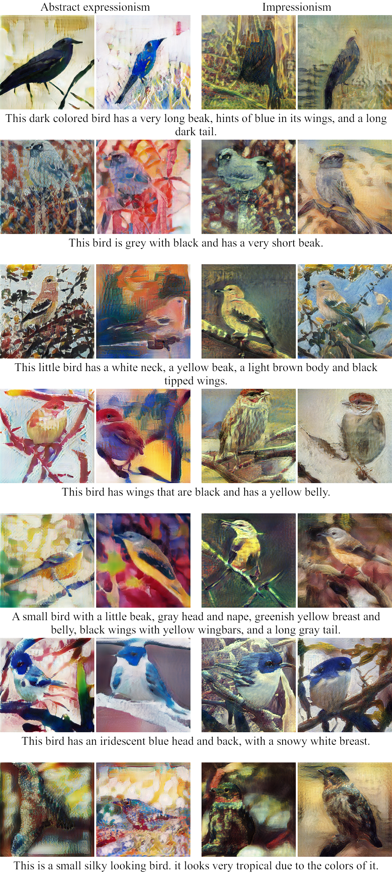
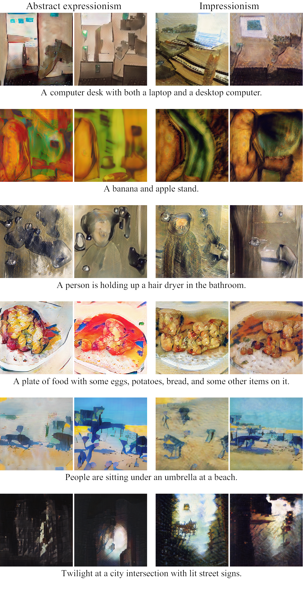
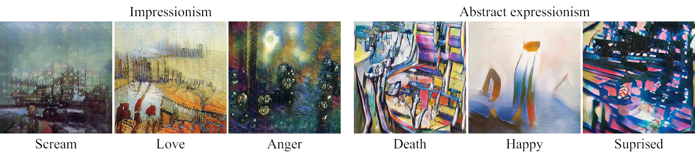

# text2art-gan
Project aimed to create a GAN, that is able to generate art just from text descriptions.

## CUB


## COCO


When given a more abstract word, the results can be quite interesting:


## Set Up
### Dependencies
- `python 3.7`
- `pytorch`
- `numpy`
- `easydict`
- `pyyaml`

### Model parameters
You can download the model parameters from [here](https://mega.nz/#!2sdgHQTA!ryWs09-BNmC4Pzh1mABGm4QXBD8XGpZU8ft1KRGWWGg).

### Installation
- Install dependecies
- Clone this repo:
```bash
git clone https://gitlab.com/karl-joan/text2art-gan.git
cd text2art-gan
```
- Download model parameters to the current working directory
- Extract model parameters
```bash
7z x parameters.7z
```

## Usage
```bash
$ python generate.py --help
usage: generate.py [-h] [-d {birds,coco}] [-n NUMBER] [-i] [-c] [-v]
                   "caption" {abstract_expressionism,impressionism}

Generate art from text

positional arguments:
  "caption"             text to generate from
  {abstract_expressionism,impressionism}
                        the style of the artwork

optional arguments:
  -h, --help            show this help message and exit
  -d {birds,coco}, --dataset {birds,coco}
                        dataset to generate from (default birds)
  -n NUMBER, --number NUMBER
                        the number of artworks to generate (default 2)
  -i, --identity        set lambda_idt = 5 instead of lambda_idt = 0.5
  -c, --cpu             use cpu
  -v, --verbose         print more details
```

```bash
$ python generate -d coco "a man is standing infront of a building" abstract_expressionism
```

## Citation
If you use the work present in this repository for your project, then please consider citing this work.

## Acknowledgments
Modified code is borrowed from [AttnGAN](https://github.com/taoxugit/AttnGAN) and [CycleGAN](https://github.com/junyanz/CycleGAN).
